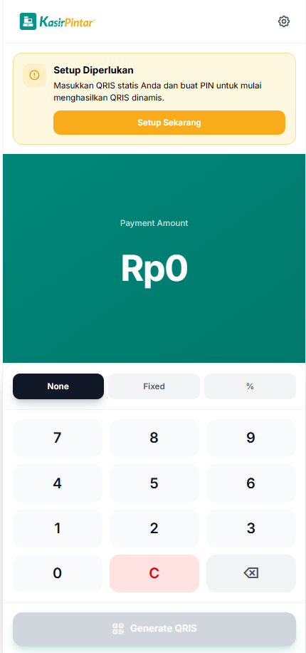
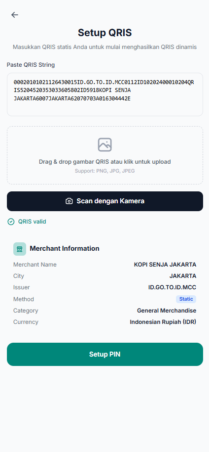
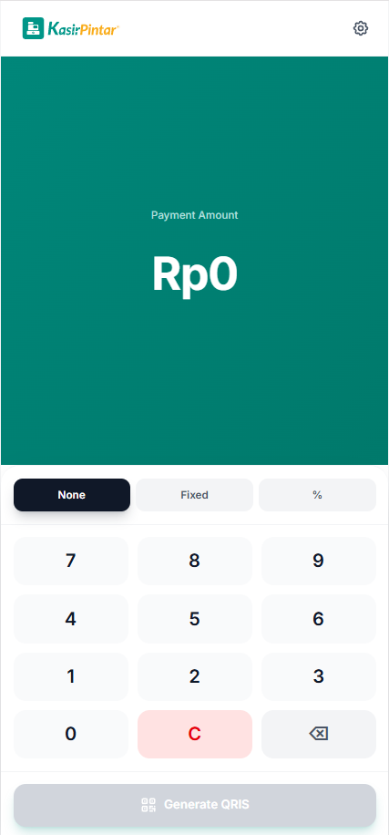
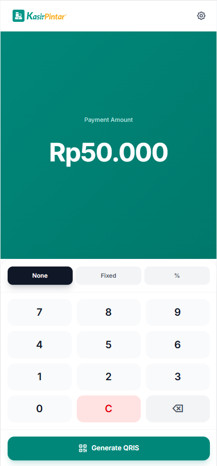
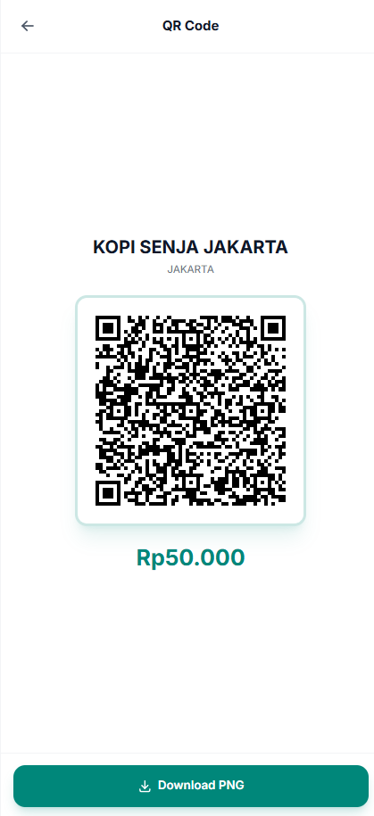
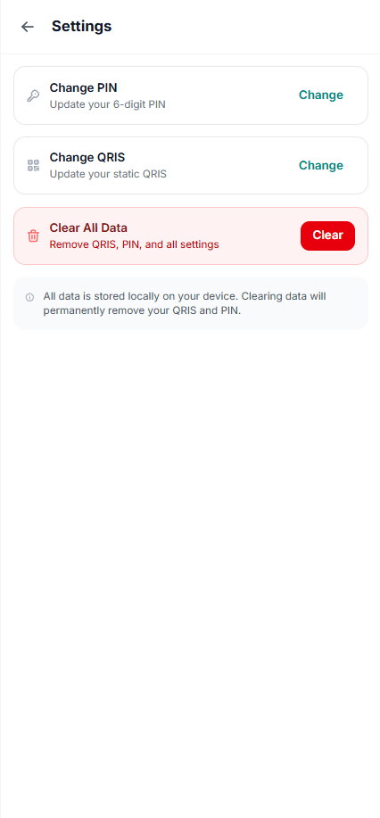
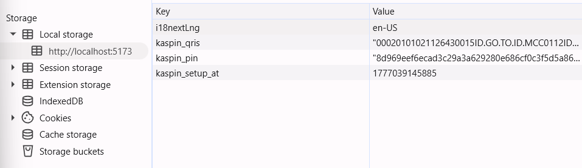
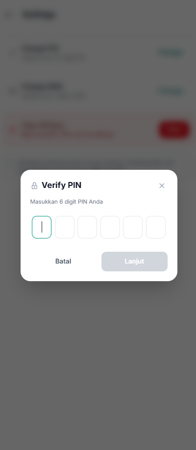
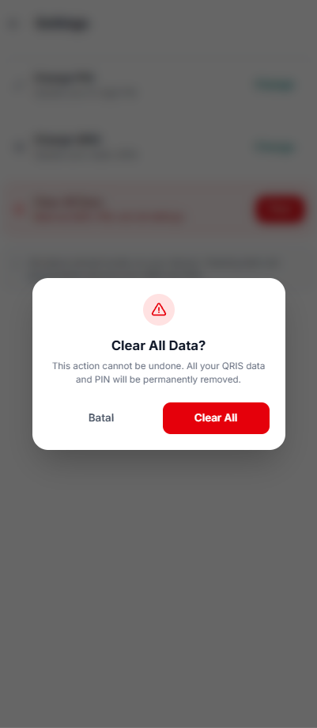
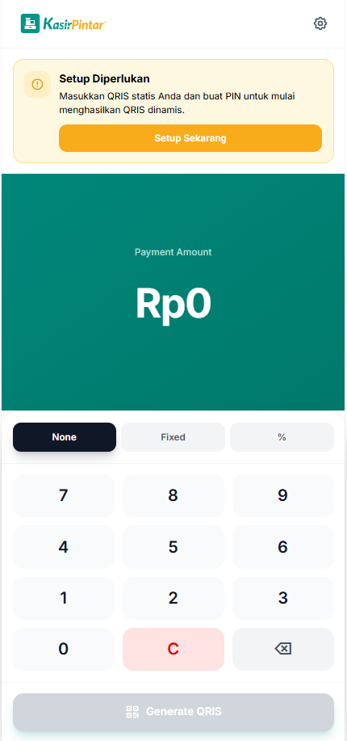

# KasPin — Dynamic QRIS Generator for UMKM

> A client-side React tool that lets Indonesian micro-merchants convert their static QRIS into dynamic, fraud-proof QR codes instantly.

---

## The Problem

Indonesian UMKM (small businesses) widely use **static QRIS** codes — printed plaques or posters that customers scan to pay. This creates three critical issues:

1. **Fraud-prone**: Customers can enter the wrong amount or show fake transfer screenshots.
2. **Slow checkout**: Cashiers must manually verify each customer's screen, creating queues.
3. **Hard reconciliation**: Incoming transfer amounts are often irregular due to customer typos.

## The Solution

KasPin solves this by letting cashiers **inject the exact charge amount** into the merchant's static QRIS string, generating a **new dynamic QR code** that locks the payment amount. The customer scans and their e-wallet immediately shows the locked amount — impossible to edit.

At its core, KasPin recalculates the EMVCo QRIS TLV structure and CRC16 checksum client-side, producing a valid dynamic QRIS code without any backend.

---

## Features

- **One-time setup** — Paste or scan your QRIS image once; data persists in browser localStorage
- **6-digit PIN protection** — Prevents unauthorized access to settings and QR generation
- **Multiple QRIS input methods** — Manual paste, drag & drop, image upload, clipboard paste, and camera scan
- **Real-time validation** — EMVCo CRC16 checksum verification on every input
- **Dynamic QR generation** — Inject any amount into the static QRIS string
- **Flexible fee handling** — None, fixed (Rp), or percentage (%) fee modes
- **QR download** — Export generated QR as high-resolution PNG (1024x1024)
- **Merchant info display** — Parses and shows merchant name, city, category (MCC), and currency
- **Numeric keypad** — Large touch-friendly buttons with physical keyboard support
- **100% client-side** — No backend, no database, no API calls

---

## Screenshots

### 1. Start Page (Empty State)



_Fresh install — "Setup Diperlukan" banner prompts user to configure QRIS and PIN_

### 2. Setup Page



_Paste QRIS string, drag & drop image, or scan with camera — real-time EMVCo validation_

### 3. After Setup (Main View)



_Setup complete — numeric keypad ready for amount entry_

### 4. Enter Amount



_Rp 50.000 entered — "Generate QRIS" button enabled_

### 5. Dynamic QR Display



_Generated QR code with merchant name (KOPI SENJA JAKARTA) and locked amount_

### 6. Settings Page



_Change PIN, Change QRIS, Clear All Data (all PIN-gated)_

### 7. Saved Data (localStorage)



_Data persisted in browser localStorage: `kaspin_qris`, `kaspin_pin` (SHA-256 hash), `kaspin_setup_at`_

### 8. PIN Verification



_6-digit PIN verification modal before generating QR_

### 9. Clear All Confirmation



_Destructive action confirmation — warns data will be permanently removed_

### 10. Clean Slate (After Clear)



_All data cleared — back to empty state with setup banner_

---

## Test QRIS (Dummy Data)

Use this valid dummy QRIS string for testing:

```
00020101021126430015ID.GO.TO.ID.MCC0112ID10202400010204QRIS5204520353033605802ID5918KOPI SENJA JAKARTA6007JAKARTA62070703A016304442E
```

**Merchant Details:**

- **Name:** KOPI SENJA JAKARTA
- **City:** JAKARTA
- **MCC:** 5203 (Hardware Stores)
- **Issuer:** ID.GO.TO.ID.MCC

This is a valid EMVCo QRIS string with correct CRC16 checksum — safe for testing and demos.

> **⚠️ Important:** This QRIS string is for **demonstration purposes only**. The merchant "KOPI SENJA JAKARTA" does not exist and is not registered with any payment gateway. Scanning the generated dynamic QR with a real e-wallet will **fail** because the underlying static QRIS is not linked to a real account. Use this dummy data only for UI testing, screenshots, and development — not for actual transactions.

For production use, merchants must obtain a valid static QRIS from their bank or payment provider and register it through the official KYC process.

---

## CTA Placement & Business Value

### Where the CTA Should Live

The CTA button should be placed on the **Point of Sale (POS) / Checkout page** of the Kasir Pintar back office dashboard, directly adjacent to the payment method selector ("E-Wallet / QRIS"). The button label could read: **"Generate QRIS Dinamis (Anti-Fraud)"**.

### Why — UX Perspective

| Reason                    | Explanation                                                                                                                                                                        |
| ------------------------- | ---------------------------------------------------------------------------------------------------------------------------------------------------------------------------------- |
| **Contextual & Seamless** | The cashier needs this tool _at the exact moment_ of facing a customer for payment. Being on the POS page minimizes context switching.                                             |
| **State Aware**           | Since the static QRIS is already saved via localStorage, the tool can auto-pull the cart total from the POS to render the dynamic QR in one click — no manual amount entry needed. |
| **Zero Training**         | The numeric keypad + single "Generate" button mimics a cash register. Cashiers already know how to use this pattern.                                                               |

### Why — Business Value

| Value Driver                   | Explanation                                                                                                                                                                                                                                    |
| ------------------------------ | ---------------------------------------------------------------------------------------------------------------------------------------------------------------------------------------------------------------------------------------------- |
| **Bring Your Own QRIS**        | PG-based QRIS integrations charge MDR (~0.7%) and delay settlement (H+1/H+2). This tool lets UMKM use their own bank's QRIS (often 0% MDR, same-day settlement) while still getting fraud protection.                                          |
| **Zero-Friction Onboarding**   | PG QRIS requires KYC verification (KTP, NPWP, legal docs) taking days. This tool lets new merchants use dynamic QRIS from day one — no KYC needed.                                                                                             |
| **Zero Fraud Guarantee**       | Eliminates customer editing transfer amounts or faking receipts. This security locks in merchant loyalty and retention.                                                                                                                        |
| **Lead Generation (Freemium)** | Deployed at a public domain (e.g. `tools.kasirpintar.co.id`), the tool acts as organic marketing. Merchants searching "cara buat QRIS dinamis gratis" enter the Kasir Pintar ecosystem, creating upsell opportunities to the full POS product. |

---

## Tech Stack

| Layer         | Technology                            |
| ------------- | ------------------------------------- |
| Framework     | Vite + React 19 + TypeScript          |
| Styling       | Tailwind CSS v4                       |
| QR Scanning   | `jsqr` (decode QR from camera/images) |
| QR Generation | `qrcode.react` (render QR as SVG)     |
| Storage       | browser `localStorage`                |
| PIN Security  | Web Crypto API (SHA-256 hash)         |

---

## How to Run Locally

```bash
# 1. Clone
git clone <repository-url>
cd kaspin-test

# 2. Install dependencies
bun install

# 3. Start dev server
bun run dev

# 4. Open http://localhost:5173
```

### Build for Production

```bash
bun run build
bun run preview   # Preview production build locally
```

### Lint & Format

```bash
bun run lint
bun run format
```

---

## How It Works

### 1. Setup Flow

1. First launch shows the **Main View** with a setup banner (if no QRIS configured)
2. Click **"Setup Sekarang"** → enter your static QRIS string (paste, upload image, or scan with camera)
3. The tool validates the QRIS string: checks EMVCo TLV structure and CRC16 checksum
4. Set a 6-digit PIN to protect settings
5. Data is saved to `localStorage` — no account needed

### 2. Generate QR Flow

1. On the main screen, enter the payment amount using the numeric keypad
2. Optionally set a fee mode: **None**, **Fixed** (Rp amount), or **Percentage** (%)
3. Tap **"Generate QRIS"** → a PIN verification modal appears
4. Enter your PIN → the dynamic QR code is generated and displayed
5. Show the QR to the customer or download as PNG

### 3. Dynamic QRIS Generation

The core algorithm:

1. Parse the static QRIS string (EMVCo TLV format) and extract existing data elements
2. Validate the static QRIS CRC16 checksum
3. Inject the payment amount (Tag 54) and transaction ID (Tag 59) into the TLV structure
4. Recalculate the CRC16 checksum
5. Encode the new string as a QR code

### 4. Settings

Access via the gear icon (top-right). PIN-gated. Options:

- **Ubah PIN** — Change your 6-digit PIN
- **Ubah QRIS** — Replace the stored QRIS string
- **Hapus Semua Data** — Clear all stored data (PIN-gated)

---

## Project Structure

```
src/
├── components/          # React UI components
│   ├── common/          # PinInput, PinModal, ConfirmDialog
│   ├── amount/          # AmountDisplay, FeeSelector
│   ├── qr/              # QRDisplay
│   ├── layout/          # Header, SetupBanner
│   └── qris/            # QRISInput, MerchantInfo
├── hooks/               # React hooks (useSetupState, usePIN, useQRISGeneration)
├── lib/                 # Core QRIS logic (parser, converter, validator, crc16)
│   ├── qris/            # EMVCo TLV processing
│   └── utils/           # Storage, formatting, crypto
├── views/               # Page-level views (MainView, SetupView, SettingsView)
└── App.tsx              # Main app with view routing
```

---

## Security Notes

- **PIN is hashed** using SHA-256 (Web Crypto API) before storage — the plaintext PIN is never persisted
- **QRIS string is stored as-is** in localStorage — this is acceptable for casual protection but should be encrypted in production
- **No backend** — all data lives in the browser. Clearing browser data = starting fresh
- **Not a payment gateway** — this tool only generates QR codes. Payment processing is handled by the merchant's bank or payment provider.
- **Client-side only** — PIN protection is designed for casual employee-level security, not cryptographic security. Users with DevTools access can bypass PIN validation or read localStorage values directly.

---

## Acknowledgments

The core EMVCo QRIS parsing and generation logic is built on top of **[qris-dinamis](https://github.com/verssache/qris-dinamis)** by [@verssache](https://github.com/verssache), licensed under the MIT License. This project adapts the library for a client-side React implementation with PIN protection and merchant-friendly UI.
